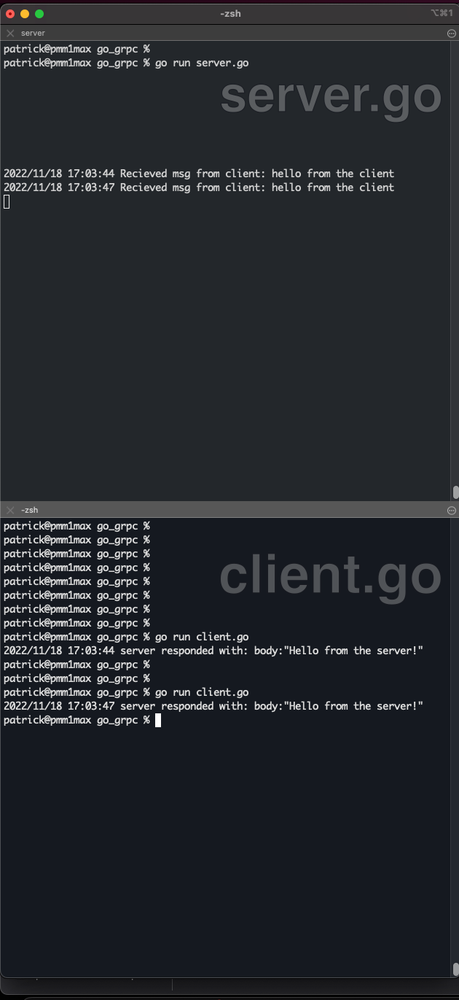

# Simplified GRPC tutorial in GO


I've made an Extremely Simplified grpc tutorial inspired by:
https://developers.google.com/protocol-buffers/docs/gotutorial 

Hopefully I've added enough helpful comments in the code 
so that you can wrap your head around grpc in go very quickly.

The most important files to look at are:
- ./chat/chat.go
- ./chat/chat_grpc.pb.go (for registration refrerences, do not edit this file)
- server.go (infinitely waits on 9000 for rpc calls)
- client.go (sends a basic rpc call to the server)


run it!
```
term 1:
go run server.go


term 2:
while true; do go run client.go; done
(CTRL C to exit)

```




dev setup for rebuilding:
```
BREW:
brew install protobuf
(libprotoc 3.21.9 as of Fri 18 Nov 2022 16:29:04 PST)
check:
protoc --version


check envvars:
export GOPATH="$HOME/go"
export GO_PATH="$HOME/go"
export GOROOT=/usr/local/go/bin/go
export GOBIN=$GOPATH/bin
export GO111MODULE=on
export PATH="$PATH:$GOROOT:$GOPATH:$GOBIN"
^ these needs to be in .zshrc or .bash_profile (depending on your shell)

do:
go install google.golang.org/grpc/cmd/protoc-gen-go-grpc@latest
go install google.golang.org/protobuf/cmd/protoc-gen-go@latest


go get
go mod tidy


# to gen *pb.go
# from official https://grpc.io/docs/languages/go/quickstart/#regenerate-grpc-code >>
protoc --go_out=chat --go_opt=paths=source_relative \
    --go-grpc_out=chat --go-grpc_opt=paths=source_relative \
    chat.proto
    
```

Exercise:
- You should try modifying the message
- Add another method/feature and re run protoc  


Other helpful resources:
https://grpc.io/blog/vendasta/
https://stackoverflow.com/questions/43682366/how-is-grpc-different-from-rest
https://thenewstack.io/grpc-lean-mean-communication-protocol-microservices/
https://grpc.io/docs/languages/go/quickstart/#regenerate-grpc-code
https://stackoverflow.com/questions/57700860/error-protoc-gen-go-program-not-found-or-is-not-executable
https://github.com/protocolbuffers/protobuf
https://github.com/protocolbuffers/protobuf/releases
https://grpc.io/docs/languages/go/quickstart/
https://stackoverflow.com/questions/61666805/correct-format-of-protoc-go-package


